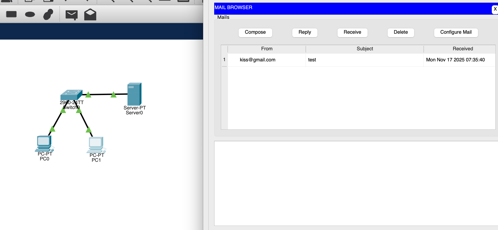
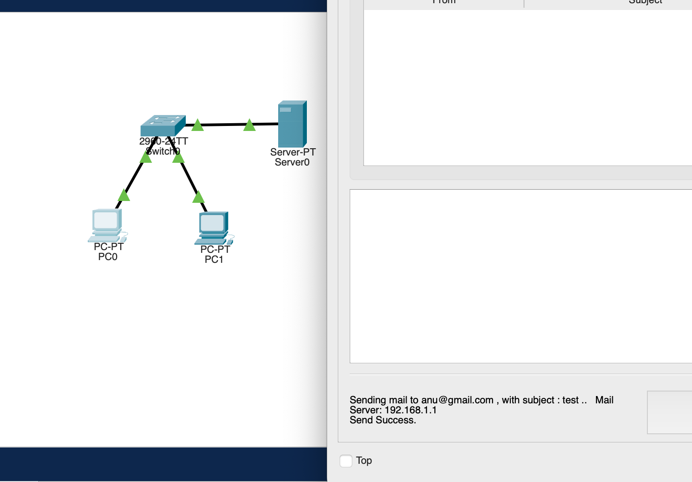

# Simulating email server
📧Today's exercise was simulating email server in **Cisco Packet Tracer**. First I set up two PCs and assigned IP addresses using DHCP.
To make DHCP work, I connected my local network (switch) to a server configured in the **192.168.x.x/24 range** ,then I 
enabled the email service on the server, added 2 email addressed and set the domain name. 
Finally,I tested the setup by pinging PC0 to PC1 as shown in the picture and the packets were sent successfully.

